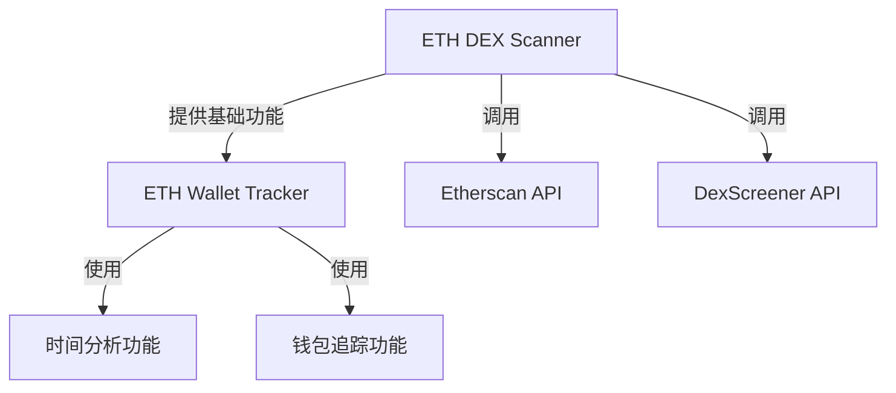

# ETH DEX Analyzer

这是一个以太坊代币交易分析工具集，包含两个主要组件：ETH DEX Scanner 和 ETH Wallet Tracker。这两个工具可以协同工作，帮助用户分析代币交易和追踪钱包活动。

## 组件关系

### ETH DEX Scanner (`eth_dex_scanner.py`)
- 基础组件，提供核心功能
- 负责与以太坊网络和 DEX 交互
- 主要功能：
  1. 获取代币交易记录
  2. 识别交易类型（买入/卖出）
  3. 获取代币价格信息
  4. 查询流动性池信息

### ETH Wallet Tracker (`eth_wallet_tracker.py`)
- 基于 DEX Scanner 的扩展工具
- 导入并使用 DEX Scanner 的功能
- 主要功能：
  1. 多时间段分析
  2. 活跃钱包识别
  3. 详细的交易记录追踪
  4. 灵活的时间范围设置

## 使用流程

1. 首先配置 ETH DEX Scanner
   - 获取 Etherscan API Key
   - 在 `eth_dex_scanner.py` 中配置 API Key
   - 确保能够正常获取代币信息

2. 然后使用 ETH Wallet Tracker
   - 直接调用已配置的 DEX Scanner
   - 输入代币地址和时间范围
   - 分析交易记录和钱包活动

## 依赖关系

## 配置要求

1. Etherscan API Key
   - 两个组件共用同一个 API Key
   - 在 DEX Scanner 中配置后自动共享

2. Python 环境
   - Python 3.6+
   - requests 库
   - datetime 库

## 使用场景

1. 基础分析（使用 DEX Scanner）
   - 查看代币当前价格
   - 监控交易历史
   - 分析单笔交易

2. 深度分析（使用 Wallet Tracker）
   - 追踪活跃交易者
   - 分析交易模式
   - 识别关键时间段

## 注意事项

1. API 限制
   - 共享同一个 API 限制
   - 需要合理控制请求频率

2. 数据一致性
   - Wallet Tracker 依赖 DEX Scanner 的数据
   - 确保 DEX Scanner 配置正确

3. 错误处理
   - 两个组件都有独立的错误处理
   - 建议先测试 DEX Scanner 再使用 Wallet Tracker
